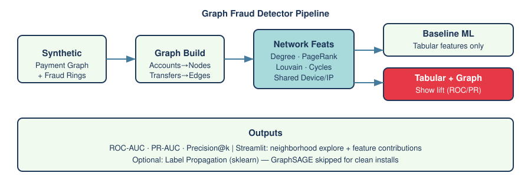
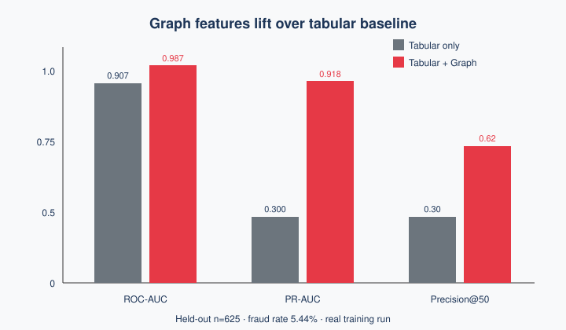

# Graph Fraud Detector

**Catch fraud rings that hide in relationships** — not just in tabular transaction stats.

This project builds an **account → transfer payment graph**, engineers network features (degree, PageRank, Louvain communities, shared devices/IPs, cycles/triangles), and shows that **tabular + graph features lift ROC-AUC / PR-AUC / Precision@k** over a tabular-only baseline.



## Why graph?

Fraud rings share devices and IPs, form dense transfer cycles, and cash out through mule accounts. Those patterns are **invisible to account-level aggregates alone**. Graph features surface collusion structure that tabular baselines miss.

## Results (held-out test, synthetic data with planted rings)

| Model | ROC-AUC | PR-AUC | Precision@50 |
|-------|---------|--------|--------------|
| Tabular only (RandomForest) | 0.9069 | 0.2995 | 0.3 |
| **Tabular + Graph (GradientBoosting)** | **0.987** | **0.9183** | **0.62** |
| RF + Graph (ablation) | 0.9853 | 0.927 | 0.62 |
| Label Propagation (optional) | 0.5512 | 0.0628 | — |

**Lift (Graph − Tabular):** ROC-AUC **+0.0801** · PR-AUC **+0.6188** · P@50 **+0.32**

Test set: n=625, fraud rate=5.44%. Metrics from a real training run in `reports/metrics.json` (never invented).



## Modeling choice

**sklearn on engineered graph features** (RandomForest / GradientBoosting) + optional **Label Propagation**.

> GraphSAGE via `torch-geometric` was **intentionally skipped** so installs stay clean and reproducible on CPU. Feature-based graph ML is production-friendly, explainable, and sufficient to demonstrate clear lift. Swap in PyG later if you need inductive message passing at scale.

## Project structure

```
graph-fraud-detector/
├── app/streamlit_app.py          # Explore neighborhoods + feature contributions
├── data/sample/                  # Small committed sample (full data generated locally)
├── models/                       # Trained joblib artifacts (generated)
├── notebooks/explore.ipynb       # Walkthrough
├── reports/
│   ├── metrics.json              # Real held-out metrics
│   ├── feature_importance.json
│   └── figures/                  # SVG + PNG
├── scripts/
│   ├── generate_data.py          # Synthetic payment graph + planted rings
│   ├── train_and_evaluate.py     # Graph feats → train → plots
│   └── run_pipeline.sh
├── src/
│   ├── config.py
│   ├── graph_features.py         # NetworkX + Louvain features
│   ├── train.py
│   └── label_propagation.py
├── requirements.txt
└── README.md
```

## Quickstart

```bash
python3 -m venv .venv
source .venv/bin/activate   # Windows: .venv\Scripts\activate
pip install -r requirements.txt

# Generate data, train, write metrics + figures
bash scripts/run_pipeline.sh

# Explore
streamlit run app/streamlit_app.py
```

Parent clone path (Windows): `C:\Users\rohit\Documents\graph-fraud-detector`

```bash
git clone https://github.com/rohithvairavel-ctrl/graph-fraud-detector.git
cd graph-fraud-detector
```

## Synthetic data design

`scripts/generate_data.py` creates:

- **~2,500 accounts**, **~10,000+ legit transfers** (preferential-attachment style)
- **12 planted fraud rings** (size 6–14) that:
  - Share a ring device ID and IP
  - Form **directed cycles** + dense clique-like transfers
  - Have **blurred** night/amount fingerprints so tabular alone is imperfect
  - Cash out to a few outsiders (mule pattern)
- Ground-truth `is_fraud` / `fraud_ring_id` on accounts

A small **sample** under `data/sample/` is committed for browsing without regenerating.

## Graph features

| Feature | Signal |
|---------|--------|
| `degree` / `in_degree` / `out_degree` | Hub / mule activity |
| `pagerank` | Structural importance in money flow |
| `clustering` / `triangle_count` | Local densification (rings) |
| `community_id` / `community_size` | Louvain communities |
| `component_size` | Connected-component scale |
| `shared_device_count` / `shared_ip_count` | Classic collusion identifiers |
| `cycle_flag` | Participation in transfer cycles |
| `neighbor_fraud_ratio_proxy` | Neighbor night-activity (no label leak) |

## Streamlit app

1. **Flagged accounts** — rank by model score; check Precision@N vs labels  
2. **Account neighborhood** — 1–2 hop subgraph around a flagged account  
3. **Feature contributions** — global importances + per-account proxy contributions  
4. **Metrics** — held-out ROC / PR / lift  

## License

MIT
